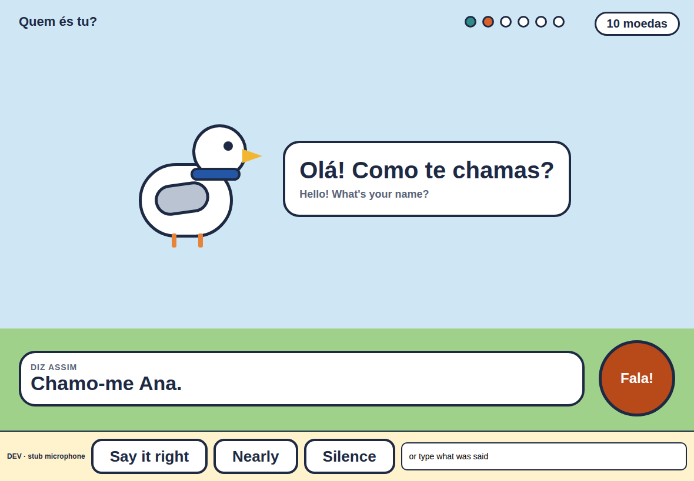
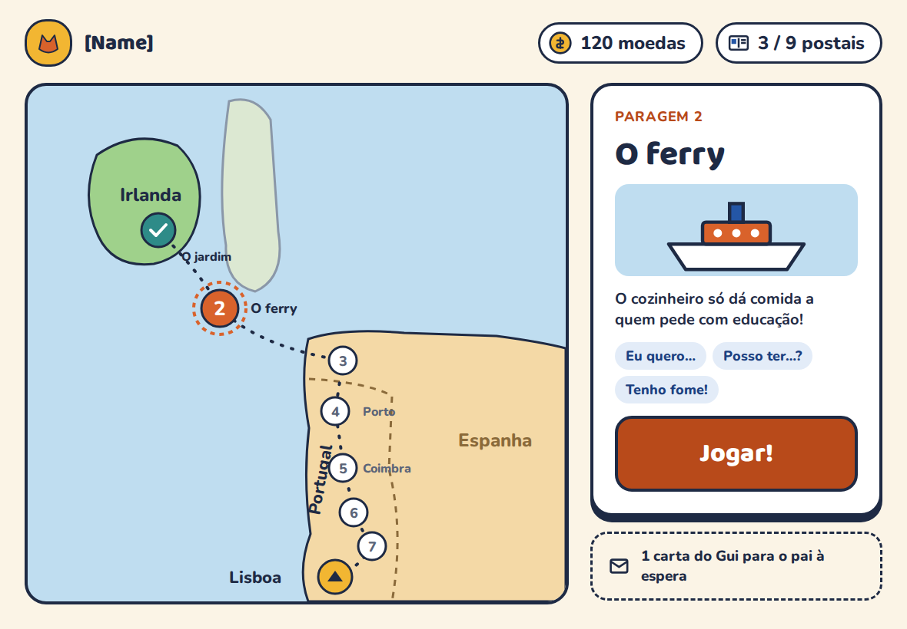

# Fala Comigo

A tablet game that gets children who understand European Portuguese to start **speaking** it. Talking is the only way forward in the game, and the Portuguese-speaking parent is part of how it's played: every session ends with a *Mission to Dad* the child can only finish by speaking to him.

<p>
  
  
</p>

## What's here

| Folder | What it holds |
| --- | --- |
| [`docs/`](docs) | The spec: [design document](docs/design.md) (concept, game design, architecture, 47 requirements, roadmap), [Unit 1](docs/unit-1.md) and [Unit 2](docs/unit-2.md) content, and the [Parent guide](docs/parent-guide.md) with its research sources |
| [`content/`](content) | Content packs the app loads: [`units/unit-01.json`](content/units/unit-01.json) and [`units/unit-02.json`](content/units/unit-02.json) (28 phrases, 6 scenes, 14 missions), [`guide.json`](content/guide.json) and Dad's clips in `audio/`. Edit these, not app code, to change what the kids say (NFR-07) |
| [`app/`](app) | The Expo (React Native) app: profiles, the learning engine, scenes, Missions to Dad, coins and the parent zone, all saved on the device |
| [`proxy/`](proxy) | The speech proxy: a Cloudflare Worker between the app and Azure Speech (pt-PT). See its [README](proxy/README.md) |
| [`design/mockups/`](design/mockups) | The 7 screen designs as standalone HTML, plus PNGs. Open [`index.html`](design/mockups/index.html) |
| [`tools/`](tools) | Scripts that generate `content/guide.json` and the GitHub issues from the docs, and create the issues |

## Run the app

You need Node 22.

```bash
cd app
npm ci
npm test            # engine, store, speech and content-pack tests
npm run typecheck
```

### In a browser (quickest while developing)

```bash
cd app
npm run web         # opens http://localhost:8081
```

Almost everything works in the browser, and changes reload as you save:
- progress and coins are saved in the browser, so a reload keeps them
- Gui speaks with the browser's text-to-speech
- Dad's recordings work and are kept in the browser too (allow the microphone when asked)

Without a speech proxy configured, a yellow **developer panel** at the bottom of each scene stands in for the microphone: *Say it right*, *Nearly*, *Silence*, or type what the child "said" to test the matcher.

Tips:
- Make the window landscape and tablet-sized, about 1180 × 820. Chrome's device toolbar can do this.
- For a European Portuguese voice, use **Microsoft Edge**, whose built-in voices include pt-PT. Chrome often only has Brazilian Portuguese.
- To start again from a fresh install, clear the site's data (DevTools → Application → Clear site data).
- The parent zone opens after holding **🔒 Pai** for 3 seconds. Long-press Gui for the parent override, and hold a star on the mission card to approve it.
- After adding a new file whose name ends in `.web.ts`, restart with `npx expo start --web --clear` so Metro picks it up.

### On a tablet

Install Expo Go, run `npx expo start` in `app/` and scan the QR code. For a standalone install, build it with EAS (`npx eas-cli build`).

### Real speech recognition

Set up the proxy (see [`proxy/README.md`](proxy/README.md)), then copy `app/.env.example` to `app/.env.local` and fill in its URL and key. The developer panel disappears and the 🎤 button becomes hold-to-talk.

## How it fits together

```
content/units/*.json ──► app/src/content ──► app/src/engine ──► app/src/screens
                                         ├─ normalize.ts  lower case, no accents, digits → words
                                         ├─ match.ts      got it / nearly / not heard, looser for the 6-year-old
                                         ├─ turn.ts       2 misses → model plays, 3rd real attempt is accepted
                                         ├─ ladder.ts     support ladder + spaced review (1, 2, 4, 8, 16 days)
                                         └─ scene.ts      filters beats by age, fills in {name}, {age}, {sibling}
app/src/speech  ── SpeechRecognizer: cloud.ts (mic → 16 kHz WAV → proxy → Azure pt-PT), stub.ts for development
app/src/store   ── on-device SQLite: profiles, progress, turn log, coins, missions
app/src/audio   ── Dad's recordings, then bundled clips, then pt-PT text-to-speech
app/src/parent  ── the parent zone: overview, missions, recordings, children, guide
```

## Working on it

- **Requirements are issues.** Each requirement in the design doc (FR-01 … FR-37, NFR-01 … NFR-10) becomes a GitHub issue with a priority label and a milestone (MVP, Phase 2, Phase 3). To create them, go to **Actions → Create issues from requirements → Run workflow**. It's safe to run again after adding requirements.
- **One issue at a time.** When building with an AI assistant, hand it one issue plus the section of `docs/design.md` it belongs to.
- **The docs are the source of truth.** After editing `docs/parent-guide.md` or the requirement tables in `docs/design.md`, regenerate:
  ```bash
  node tools/build-guide.mjs    # → content/guide.json
  node tools/build-issues.mjs   # → tools/issues.json
  node tools/build-audio.mjs    # → app/src/content/audioClips.ts, after adding clips to content/audio/
  ```
  CI fails if you forget.
- **CI** runs on pushes to `main` and on pull requests: generated files up to date, typecheck, tests, an Android bundle, and the proxy's tests.

## Next steps

1. **Test speech recognition with the kids (FR-07, NFR-01).** Deploy the proxy, then check that fewer than 1 in 5 correct answers is rejected and that results come back within 2 seconds.
2. **Dad's recordings.** Record the clips in the parent zone (My recordings), or add them to `content/audio/` as listed in [unit-1.md](docs/unit-1.md#dads-part) and [unit-2.md](docs/unit-2.md#dads-part).
3. **Phase 2** (the full trip): the remaining units, the map and album, sibling modes and the parent dashboard.

## Licence

Code and content: [Eclipse Public License 2.0](LICENSE). Mockup fonts (Baloo 2, Nunito): SIL Open Font License, see [`design/mockups/fonts`](design/mockups/fonts).
