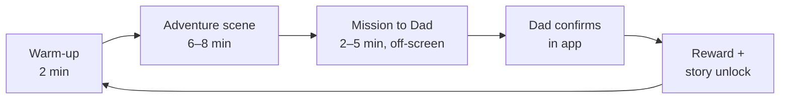
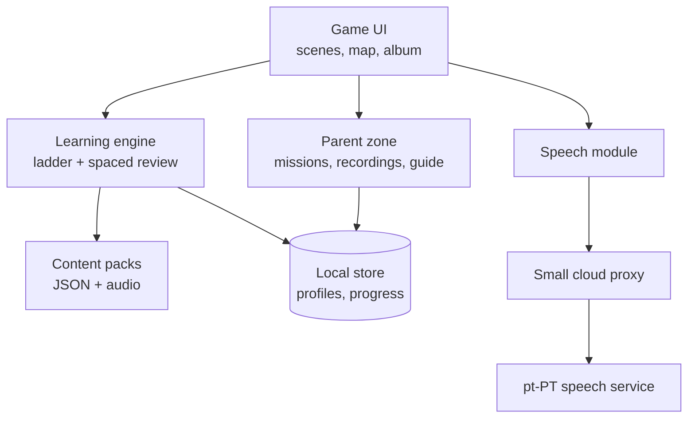

# Fala Comigo — Portuguese speaking game

Design document · exported from the living doc on 2026-09-27

Fala Comigo ("Talk to me") is a tablet game that gets an 8- and a 6-year-old saying European Portuguese out loud. Talking is the only way forward in the game, and Dad, their native-speaking parent, is part of how it's played.

Related documents: [Unit 1 content](unit-1.md) · [Unit 2 content](unit-2.md) · [Parent guide](parent-guide.md)

## 1. Concept

**The problem.** The kids are *passive bilinguals*: they understand Portuguese but can't produce it. This is the usual pattern in one-parent-one-language homes where the majority language wins. Understanding comes from hearing. Speaking only grows with practice at *retrieving* words and building sentences under light pressure. They get almost no such practice today, because answering in English always works.

**The core idea.** Make Portuguese the only currency that works. In Fala Comigo, the kids help a lost Portuguese character get home, and everything they do in the game costs spoken Portuguese: opening doors, feeding a pet, buying things, asking for help. The app handles the practice. Dad handles the real conversation: the game sends them on **Missions to Dad** that they can only finish by speaking to him.

**Design pillars**

1. **Speaking is the only way to move forward.** Tapping, reading and listening support speaking but never replace it. Each session aims for at least 60 spoken turns.
2. **Dad is the best native speaker in the house.** The app sets up real conversations with him and doesn't try to replace them.
3. **Useful chunks before grammar.** Teach whole phrases kids actually need ("Posso ter…?", "Onde está…?", "Eu quero…") and never explain conjugation tables.
4. **Mistakes are cheap and funny.** Never a red X for how they pronounce things. A near miss still works, with a gentle recast.
5. **Short, daily, together.** 10–15 minutes a session. The two older kids can play side by side, co-operatively or in friendly competition.
6. **European Portuguese, sounding like home.** The vocabulary, accent and cultural details match the family (pequeno-almoço, autocarro, a avó, bacalhau).

## 2. How it plays

Each session is one short **episode**: warm-up, an adventure scene played in the app, and a Mission to Dad that sends the kids off the tablet to talk to him.

The Mission to Dad is where the real conversation happens, and Dad's approval is what unlocks the next part of the story. The planned rhythm is **2 app sessions a week and a Mission to Dad every day** (see the [Parent guide](parent-guide.md), card 5).

### The three play modes

| Mode | Who | What happens | Why it matters |
| --- | --- | --- | --- |
| **Adventure** (solo) | One child + tablet | The child talks to in-game characters to solve small problems: order food, find a lost cat, give directions. The app listens and responds. | High-volume speaking practice without anyone waiting on them |
| **Mission to Dad** | Child + Dad | The app sets a real-world task: "Pergunta ao pai o que ele comeu ao almoço" ("Ask Dad what he ate for lunch"), or "Diz ao pai três coisas que vês na cozinha" ("Tell Dad three things you can see in the kitchen"). Dad approves it with one tap or a quick 1–3 star rating. | Moves speaking from the app into real life, which is the actual goal |
| **Duelo / Equipa** (siblings) | 8yo + 6yo | Pass-the-tablet games: describe a picture for your sibling to guess, or build a story together one sentence at a time. The older child sometimes gets to be the helper. | Portuguese becomes something they do together, not just with Dad |

### A typical session (about 12 minutes)

1. **Warm-up (2 min).** The mascot says hello and asks two quick questions the child answers aloud: "Como estás hoje?" ("How are you today?") and "O que comeste ao pequeno-almoço?" ("What did you have for breakfast?"). This also reviews phrases due for practice.
2. **Adventure scene (6–8 min).** One problem to solve, needing 4–6 target phrases. The support level adjusts to how the child is doing (see Learning design).
3. **Mission to Dad (off-screen).** The mission card shows a picture and the target phrase, and plays it in Dad's recorded voice. The child goes and finds him.
4. **Reward.** Dad taps to approve. The child gets coins and a sticker, and a short cliffhanger for the next episode plays.

## 3. Learning design

The learning engine walks every phrase up a **support ladder**, from copying what they hear to saying it on their own. Help is removed only once the child succeeds without it. Because the kids already understand a lot, most phrases can start on rung 2 or 3.

### The support ladder

| Rung | Name | What the child does | Example ("Posso ter água?" / "Can I have water?") |
| --- | --- | --- | --- |
| 1 | Echo | Hears the phrase, then repeats it | Mascot: "Posso ter água?" → child repeats it |
| 2 | Pick & say | Picks from 2–3 spoken options, then says the one they picked | Three picture bubbles, child says the right one |
| 3 | Fill the gap | Finishes a phrase that's already started | "Posso ter…" + picture of water → "…água?" |
| 4 | Prompted | Sees a situation with no words and responds | A thirsty character at a café → child asks for water |
| 5 | Free | Uses the phrase unprompted in a new context, or on a Mission to Dad | Asks Dad for water at dinner, in Portuguese |

A phrase moves up one rung after two successes on different days. After two failures in a row, it drops back one rung and the phrase is played as a model. There's no penalty.

### Principles

- **Output practice beats more input.** They already get plenty of input from Dad. Every activity must end with the child saying something, never just tapping.
- **Chunks first.** Build on about 30 "power phrases" that unlock lots of situations (Posso…?, Eu quero…, Onde está…?, Não sei, Como se diz…?, Olha!, Eu gosto de…, Tenho…). Then swap in new words at the slots: "Eu quero *um gelado* / *ir ao parque*".
- **Spaced repetition.** Each phrase has a next-review date, which grows after successes (1 → 2 → 4 → 8 → 16 days). Warm-ups pull from the phrases that are due.
- **Recast, don't correct.** When the child says "Eu quero o água", the character replies naturally with the correct form ("Queres a água? Aqui está!") and the game carries on.
- **"Como se diz…?" is a superpower.** Asking how to say something always works: the child can say the English word and the game gives it back in Portuguese. It's the most important survival phrase in real life, and every use counts as speaking.
- **Dad's voice is the model.** Recordings of Dad are used for key phrases wherever possible, so the kids copy the accent they hear at home.

### Topics (first 8 units)

Chosen for what the kids would actually say to Dad at home.

| Unit | Topic | Sample power phrases |
| --- | --- | --- |
| 1 | Olá! Me and my family | Chamo-me…, Tenho … anos, Este é o meu irmão |
| 2 | Food and the table | Eu quero…, Posso ter…?, Tenho fome, Está bom! |
| 3 | Playing | Vamos brincar?, É a minha vez, Ganhei! |
| 4 | Where is it? | Onde está…?, Está debaixo/em cima de… |
| 5 | Feelings and the body | Estou cansado/contente, Dói-me… |
| 6 | My day | Hoje eu fui…, Na escola eu… (first steps into the past tense) |
| 7 | Visiting the grandparents | Obrigado, avó!, Posso ir…?, Tenho saudades |
| 8 | Stories | Era uma vez…, E depois…, No fim… |

Unit 7 connects to real trips to Portugal. If a visit is coming up, it can move earlier. The full Unit 1 content is in [unit-1.md](unit-1.md).

## 4. Game world and progression

The story is a trip from Ireland to Portugal. **Gui, a seagull from Lisbon**, gets blown off course in a storm and lands in the kids' garden. He only speaks Portuguese, so the kids have to talk to him and to everyone they meet to get him home. The story mirrors the family's own two countries.

### The journey (one stop per unit)

| Stop | Place | Unit | Story beat |
| --- | --- | --- | --- |
| 1 | The back garden, Ireland | Olá! Me and my family | Gui arrives. The kids introduce themselves. |
| 2 | The ferry | Food and the table | The ship's cook will only feed people who ask nicely. |
| 3 | A beach in Galicia | Playing | Kids on the beach will only share if you play with them. |
| 4 | Porto | Where is it? | Gui's map is lost somewhere along the Ribeira. |
| 5 | Coimbra | Feelings and the body | Gui is sick and the doctor needs to know what hurts. |
| 6 | A train south | My day | Tell the conductor what happened on the trip so far. |
| 7 | The grandparents' village | Visiting the grandparents | Can be customised with the real grandparents' town and names. |
| 8 | Lisbon | Stories | Gui's family asks for the whole story of the trip. |

### Characters

- **Gui (a gaivota):** the mascot and guide. He's a bit of a clown and confuses words himself, which makes mistakes feel normal.
- **The locals:** one or two recurring characters at each stop (the ferry cook, a Porto fisherman, the train conductor). Each one needs specific phrases.
- **O Pai:** Dad appears in the game as a character. His photo and recorded voice can be added, and Missions to Dad are shown as letters from Gui addressed to him.

### Rewards

- **Postcards (postais):** each finished scene adds a postcard to a travel album. A full album for a stop unlocks the next stop on the map.
- **Moedas (coins):** earned for each thing said out loud. They're spent on outfits for Gui and decorations for his nest, and buying things needs speech too ("Quero o chapéu azul").
- **Dad's stars:** 1–3 stars from Dad on each mission, worth the most coins. This makes talking to Dad the most rewarding thing in the game.
- **Real-world rewards (optional):** a small real reward for a finished stop, like choosing Saturday's pastel de nata run.
- **No punishing streaks.** Missing a day costs nothing. Gui just says "Tive saudades!" ("I missed you!"). Guilt makes kids avoid a language, not use it.

### Adapting to the 6- and 8-year-old

| | 6-year-old | 8-year-old |
| --- | --- | --- |
| Reading | Pictures and audio only. Text is optional and off by default. | Portuguese text shown after they've said the phrase, to build reading. |
| Starting rung | Rung 1–2 | Rung 2–3 |
| Phrases per scene | 3–4 | 5–6 |
| Length of answer expected | One or two words ("água", "quero água") | A full sentence, later two linked with "e" or "porque" |
| Missions to Dad | Say one thing | A short exchange of 2–3 turns |
| In sibling mode | Mostly guesses and answers | Can act as the helper who gives clues in Portuguese |

Each child has their own profile, so they progress separately. Sibling modes pair them at a level both can manage.

## 5. Architecture

The app is local-first: content, progress and Dad's voice recordings all live on the tablet. The one essential cloud call is speech recognition for European Portuguese, made through a small proxy so the API keys stay off the device. The hardest technical problem is recognising children's speech, so the design deliberately avoids depending on perfect recognition.

The speech module sends audio through the proxy and gets back a transcript and scores. The learning engine decides what happens next.

### Judging speech: generous by design

Children's voices and accents are hard for speech recognisers, and a game that says "wrong" to a correct answer will lose the kids quickly. So the app never judges whether a child sounds native. It only checks whether they **made a real attempt at the target phrase**:

1. Transcribe the audio as pt-PT, with a hint telling the recogniser which phrase is expected.
2. Normalise the result (lower-case, remove accents and punctuation) and fuzzy-match it against a list of accepted versions (for example "quero água", "eu quero água", "quero a água").
3. Sort into one of three results:
    - **Got it:** a close enough match. The game carries on.
    - **Nearly:** some of the key words were there. The game carries on and the character repeats it correctly (the recast).
    - **Didn't catch it:** Gui says "Hmm? Outra vez!" ("Say it again!"). After two tries the model phrase plays, and the third attempt is accepted if the child says anything at all.
4. English detected: the game treats it as "Como se diz…?" and gives the Portuguese.
5. **Dad override:** in any scene, a hidden long-press lets Dad mark "I heard it" if he's nearby.

### Technology options

These are suggestions to test during the prototype, not final decisions.

| Part | Suggested option | Alternatives | Notes |
| --- | --- | --- | --- |
| App framework | React Native with Expo (iOS and Android tablets) | Flutter; native Swift for iPad only | Expo works well with AI coding assistants and runs on both platforms |
| Speech recognition | Azure Speech, pt-PT, with pronunciation assessment | Google Cloud Speech-to-Text pt-PT; Apple's on-device recogniser on iPad | Azure's pronunciation assessment [lists pt-PT as supported](https://github.com/MicrosoftDocs/azure-ai-docs/blob/main/articles/ai-services/speech-service/includes/language-support/pronunciation-assessment.md) and scores at word level. Accuracy on children's voices must be tested with the kids. |
| Model voices | Dad's own recordings for the core phrases | Neural pt-PT text-to-speech voices for everything else | Dad's voice matters more than polish |
| Proxy | One serverless function (e.g. Cloudflare Workers, Azure Functions) | A tiny Node server | Holds the keys and adds usage limits |
| Local store | SQLite (expo-sqlite) | AsyncStorage for the first prototype | |
| Content | One JSON file per unit, plus audio files | A headless CMS later | Easy to edit with AI help |
| Free conversation (later phase) | A language model with tight guardrails, playing a character | Leave it out | Only after the basic loop works, and only with the parent zone switched on |

### Privacy and child safety

The players are children in Ireland, so GDPR applies to their voice recordings.

- Audio is sent only to transcribe it and is not kept by default. Pick a speech provider setting that doesn't keep or train on the audio.
- Kids' recordings are only saved on the tablet when a parent turns on "let me listen back" in the parent zone.
- No accounts, ads, chat with strangers or in-app purchases. The parent zone is behind a parental gate.

## 6. Requirements

There are 37 functional and 10 non-functional requirements. The **Must** items make up the MVP. Each one is also a GitHub issue (see [`tools/issues.json`](../tools/issues.json)).

### Functional requirements

| ID | Area | Requirement | Priority |
| --- | --- | --- | --- |
| FR-01 | Profiles | Each child has their own profile with a name, avatar and age band (6 or 8). Each profile keeps its own progress. | Must |
| FR-02 | Profiles | A child can pick their profile in 2 taps or fewer, using the avatar alone, without reading. | Must |
| FR-03 | Gameplay | Every scene needs spoken input to move forward. There is no way through by tapping alone. | Must |
| FR-04 | Gameplay | Scenes are loaded from content packs. Each defines its characters, target phrases, accepted versions, starting rung, pictures and audio. | Must |
| FR-05 | Gameplay | Every target phrase has a model audio clip: Dad's recording if there is one, otherwise a pt-PT text-to-speech voice. | Must |
| FR-06 | Speech | Hold-to-talk mic button that shows clearly when it's listening. Recordings stop automatically after 6 seconds or on silence. | Must |
| FR-07 | Speech | Audio is transcribed as pt-PT with the expected phrase as a hint. The result is Got it, Nearly or Didn't catch it. | Must |
| FR-08 | Speech | Fuzzy matching against the accepted versions, with a strictness setting per age band (looser for the 6-year-old). | Must |
| FR-09 | Speech | After 2 failed attempts the model phrase plays, and the 3rd attempt is accepted if any speech is heard. | Must |
| FR-10 | Speech | On a Nearly result, the character repeats the correct form naturally (a recast) and the game carries on. | Should |
| FR-11 | Speech | "Como se diz?" button: the child says a word in English and gets it back in Portuguese from the unit's word list. It counts once they repeat it. | Should |
| FR-12 | Speech | Parent override: a hidden long-press marks the current turn as "I heard it". | Must |
| FR-13 | Learning | For each child and phrase, store the rung, successes, failures, last-seen date and next review date. | Must |
| FR-14 | Learning | Move a phrase up a rung after 2 successes on different days, and down one after 2 failures in a row. Review intervals: 1, 2, 4, 8, 16 days. | Must |
| FR-15 | Learning | The warm-up includes up to 5 phrases that are due for review. | Should |
| FR-16 | Learning | Sessions aim for 10–15 minutes and end gently (Gui gets sleepy), with no hard lock-out. | Should |
| FR-17 | Mission to Dad | Each episode ends with a mission built from the phrases just practised. The card shows a picture and the phrase, and plays Dad's audio. | Must |
| FR-18 | Mission to Dad | The parent approves a mission with 1–3 stars, behind a parent-only gate (PIN or a hold gesture). | Must |
| FR-19 | Mission to Dad | Missions can be left for later and stay open for up to 48 hours. Several can be waiting at once. | Should |
| FR-20 | Rewards | Coins for every spoken turn, and bonus coins for Dad's stars. | Must |
| FR-21 | Rewards | Postcard album. Filling a stop's postcards unlocks the next stop on the map. | Should |
| FR-22 | Rewards | Gui's shop, where buying things is done by saying the item in Portuguese. | Could |
| FR-23 | Rewards | No streak penalties and no lost progress for missed days. | Must |
| FR-24 | Siblings | Pass-the-tablet "describe and guess" game for the two older kids. | Should |
| FR-25 | Siblings | Build a story together, one spoken sentence each. | Could |
| FR-26 | Parent zone | Record, play back and re-record Dad's voice for any phrase in the content. | Must |
| FR-27 | Parent zone | Dashboard for each child: phrases per rung, spoken turns per day, missions done, phrases they're struggling with. | Should |
| FR-28 | Parent zone | Edit accepted versions, and add custom phrases and names (siblings, grandparents, their village). | Should |
| FR-29 | Parent zone | Settings for each child: text on or off, session length, and the "listen back" recording option. | Should |
| FR-30 | Content | The MVP ships Units 1–2 with about 30 phrases. The full plan is 8 units. | Must |
| FR-31 | Content | Free conversation with a character, run by a language model with tight guardrails. | Could |
| FR-32 | Content | Toddler mode for the 2-year-old: listen, point and copy sounds. | Could |
| FR-33 | Parent guide | A Guide section in the parent zone with 8 short cards. Each card has a title, 100–200 words and a "Try this week" action. It works offline. | Must |
| FR-34 | Parent guide | A "Tip of the week" on the parent Overview screen that shows one card and moves to the next each week. | Should |
| FR-35 | Parent guide | Each card shows numbered references. Tapping one opens the source in the browser, behind the parental gate. Cards are labelled "Research" or "Practical advice". | Must |
| FR-36 | Parent guide | Guide text and sources are stored as content files, like the units, so they can be edited without changing code. | Should |
| FR-37 | Parent guide | The weekly plan in card 5 can be ticked off week by week, and appears next to the unprompted-Portuguese counter. | Could |

### Non-functional requirements

| ID | Area | Requirement | Priority |
| --- | --- | --- | --- |
| NFR-01 | Performance | Speech results come back within 2 seconds for 90% of turns on home Wi-Fi. | Must |
| NFR-02 | Offline | Everything except speech recognition works offline. With no connection, speaking turns fall back to "any voice for 1 second or more counts" plus the parent override. | Must |
| NFR-03 | Usability | A 6-year-old can play without reading: every instruction is spoken and shown with an icon. | Must |
| NFR-04 | Usability | Touch targets of at least 60 pt. Runs on current iPads and Android tablets in landscape. | Must |
| NFR-05 | Privacy | Audio isn't kept by the speech service or the proxy. No accounts, ads, tracking or in-app purchases. Meets GDPR for children's data. | Must |
| NFR-06 | Cost | Cloud costs stay under about €5 a month for two kids at 15 minutes a day. The proxy caps daily usage. | Should |
| NFR-07 | Maintainability | Content (phrases, scenes, missions) is plain JSON plus audio files and can be changed without code changes. | Must |
| NFR-08 | Reliability | Progress is saved after every turn. Closing the app never loses more than the current turn. | Must |
| NFR-09 | Wellbeing | Calm visuals with no flashing, no countdown timers, and no loot boxes or other manipulative mechanics. | Must |
| NFR-10 | Accessibility | Separate volume controls for voice and music, and optional subtitles. | Should |

## 7. MVP and roadmap

Start with a one-week test on paper before writing any code. It checks the riskiest assumption, that the kids will do Missions to Dad at all, and costs nothing.

| Phase | Length | What gets built | How you'll know it worked |
| --- | --- | --- | --- |
| 0. Paper test | 1 week | 7 mission cards drawn by hand, a sticker chart, and Gui as a soft toy or drawing. Dad plays the character. | Both kids finish 5 or more missions without being nagged |
| 1. MVP | About 4–6 weeks of evenings | The Must requirements: profiles, Units 1–2, the speech loop, the learning engine, Missions to Dad, coins, Dad's recordings, the parent guide | Each child manages 40 or more spoken turns per session, and fewer than 1 in 5 correct answers is wrongly rejected |
| 2. The full trip | About 2 months | All 8 units, the map and album, sibling modes, the parent dashboard and custom phrases | Kids choose to play without being asked in the second month |
| 3. Conversation | Later | Free conversation with characters, and toddler mode | Portuguese starts showing up at home unprompted |

At 2 app sessions a week, each unit lasts about 3–4 weeks, so the 8 planned units give roughly 6–7 months of play.

### Measuring what matters

The real goal is Portuguese spoken to Dad, not points in the game. For one week before Phase 0, tally how often each child says something in Portuguese to Dad without being asked. Repeat the tally every month. The parent zone's counter takes this over later.

### Building it with AI help

- Build in thin, end-to-end slices: one scene, one phrase, the mic, speech recognition, the result and a coin. Test it with the kids before adding more.
- Test the speech service first. Record each child saying the 30 MVP phrases, run the recordings through two providers, and pick the one that rejects fewer correct attempts.
- Keep this doc as the spec. Hand the AI one requirement ID (one GitHub issue) at a time, together with the section of this doc it belongs to.

## 8. Open questions

- [ ] **Their mother's role:** should the Irish side of the family feature too, for example the kids teaching Mum a Portuguese word as a mission? It could make Portuguese something the kids share, not just "Dad's language".
- [ ] **Grandparents:** could the avós record phrases or join video-call missions? It's the strongest real-world reason to speak Portuguese.
- [ ] **Tablets:** iPad, Android or both? This decides whether the on-device recogniser can be the offline fallback.
- [ ] **Screen time:** does this count toward their daily allowance, or is it an exception? That affects the target session length.
- [ ] **Names:** Gui and Fala Comigo are placeholders. The kids could choose the seagull's name, which gives them ownership from day one.
- [ ] **The 2-year-old:** include them now as a watcher in sibling modes, or wait for Phase 3?

## Sources

- [Azure Speech: languages supported for pronunciation assessment](https://github.com/MicrosoftDocs/azure-ai-docs/blob/main/articles/ai-services/speech-service/includes/language-support/pronunciation-assessment.md)
- [Azure Speech: language support overview](https://learn.microsoft.com/en-us/azure/ai-services/speech-service/language-support)

The research sources for the teaching approach are listed in the [Parent guide](parent-guide.md#sources).
